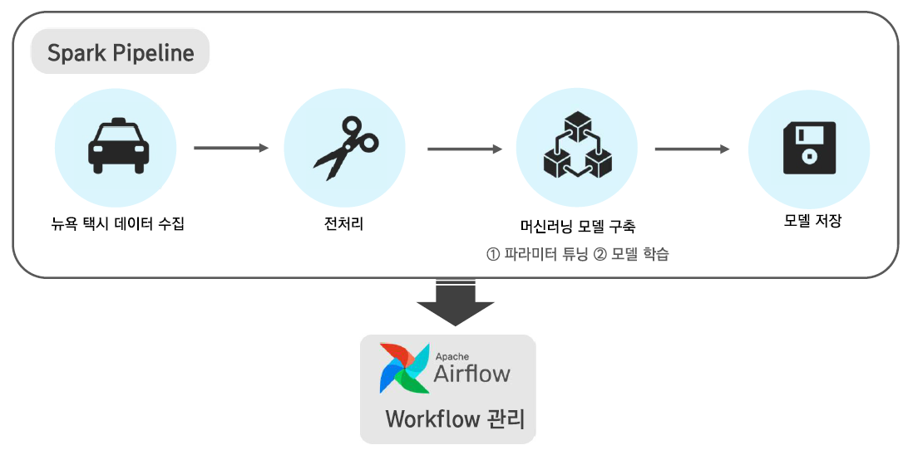
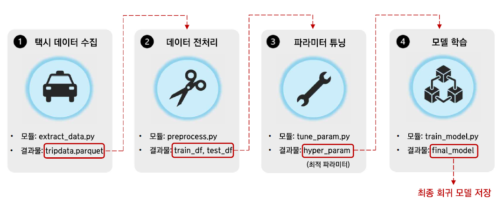
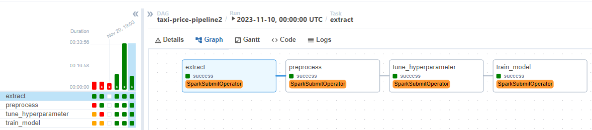

 ## 💻 사용 스킬

- `Language` : `Python` , `SQL`
- `Tool` : `Spark`, `Airflow`, `Pandas`, `Matplotlib`, `Seaborn`, `Ubuntu`, `Jupyter notebook`   
  
<br>


## 📂 프로젝트 개요

**[프로젝트명]** 택시요금 예측 및 파이프라인 구축 프로젝트

**[기간]** 2023.11

**[인원]** 개인 프로젝트

**[프로젝트 목적]** 

- Spark ETL 파이프라인 설계: 데이터 수집부터 ML 모델 구축 및 저장.
- Airflow로 workflow 관리: airflow를 활용하여 pipeline 관리 및 스케쥴링.
- 뉴욕의 yellow taxi 데이터를 활용한 택시 요금의 분석 및 예측

**[진행 과정]**

- Spark
    - 데이터 수집 및 적재: spark 사용하여 parquet 형태로 수집 및 적재.
    - 데이터 전처리: Spark SQL 사용.
    - 모델 구축: spark MLlib 사용하여 파라미터 튜닝 후 best parameter로 모델 학습.
    - 최종 모델 저장: parquet 형태로 저장.
- Airflow: Spark pipeline 관리 및 스케줄링
    

**[폴더 구조]**

```bash
**ubuntu**
	├── **airflow**  
	│    └── dags  # airflow의 dag를 저장
	└── **working**
	     └── **taxi_analysis2**
						├── **spark_pipeline** # dag에서 실행할 spark pipeline 저장
						│   ├── extract_data.py
						│   ├── preprocess.py
						│   ├── train_model.py
						│   └── tune_param.py
						└── **data** 
                                ├── raw_data # 1️⃣ 뉴욕 택시 데이터(raw data) 저장
                                ├── train_test 
                                │       ├── test # 2️⃣ 머신러닝 test data 저장
                                │       ├── train # 2️⃣ 머신러닝 train data 저장
                                │       └── param # 3️⃣ 파라미터 튜닝 결과 저장
                                └── lr_model # 4️⃣ 최종 머신러닝 모델 저장 
```
<br>


## 📈 EDA
**[데이터 설명]**

- 총 19개 피처 中 6개만 사용.
    - tpep_pickup_datetime : 탑승 시간
    - passenger_count: 탑승 승객 수
    - trip_distance: 이동 거리
    - PULocationID: 탑승 위치, DOLocationID: 하차 위치
    - total_amount: 총 요금 (회귀 분석에서 목표 변수)
    
    ```bash
    root
     |-- VendorID: long (nullable = true)
     |-- **tpep_pickup_datetime**: timestamp (nullable = true)
     |-- tpep_dropoff_datetime: timestamp (nullable = true)
     |-- **passenger_count**: double (nullable = true)
     |-- **trip_distance**: double (nullable = true)
     |-- RatecodeID: double (nullable = true)
     |-- store_and_fwd_flag: string (nullable = true)
     |-- **PULocationID**: long (nullable = true)
     |-- **DOLocationID**: long (nullable = true)
     |-- payment_type: long (nullable = true)
     |-- fare_amount: double (nullable = true)
     |-- extra: double (nullable = true)
     |-- mta_tax: double (nullable = true)
     |-- tip_amount: double (nullable = true)
     |-- tolls_amount: double (nullable = true)
     |-- improvement_surcharge: double (nullable = true)
     |-- **total_amount**: double (nullable = true)
     |-- congestion_surcharge: double (nullable = true)
     |-- airport_fee: double (nullable = true)
    ```
    

- [EDA1. 데이터 확인](https://github.com/JeeyeonKim00/Toy_project/blob/dde1eb783a7c6c4967577ae70d3ee4c29ac6de81/taxi_analysis/working/taxi_analysis2/taxi_analysis.ipynb)

- [EDA2. 회귀 분석](https://github.com/JeeyeonKim00/Toy_project/blob/dde1eb783a7c6c4967577ae70d3ee4c29ac6de81/taxi_analysis/working/taxi_analysis2/taxi_fare_prediction.ipynb)

<br>

## ⚡Spark process


1️⃣ **데이터 수집**

- 모듈명: [extract_data.py](C:\Users\TEMP\OneDrive\문서\GitHub\Prj_TaxiAnalysis\working\taxi_analysis2\spark_pipeline\extract_data.py)
- Used library: `pyspark.sql`, `requests`
- 주요 기능:
    - requests → 뉴욕 택시 데이터 사이트에서 데이터 수집
    - spark→ 수집한 데이터 적재
- 결과물:  tripdata.parquet

<br>

2️⃣ **데이터 전처리**
- 모듈명: [preprocess.py](C:\Users\TEMP\OneDrive\문서\GitHub\Prj_TaxiAnalysis\working\taxi_analysis2\spark_pipeline\preprocess.py)
- Used library: `pyspark.sql`
- 주요 기능 
    - Spark SQL로 데이터 전처리
    - train, test data 분할 (8:2) 및 저장   
- 결과물: train_df, test_df
  
<br>

3️⃣ **파라미터 튜닝** 

- 모듈명: [tune_param.py](C:\Users\TEMP\OneDrive\문서\GitHub\Prj_TaxiAnalysis\working\taxi_analysis2\spark_pipeline\tune_param.py)
- Used library: `pyspark.sql` `pyspark.ml`
- 주요 기능
    - 모델링 Pipeline 생성
    - 파라미터 튜닝 (cross validation) 및 최적 파라미터 추출
- 결과물: hyper_param(최적 파라미터)

<br>


**4️⃣ 모델 학습 with best parameter** 

- 모듈명: [train_model.py](C:\Users\TEMP\OneDrive\문서\GitHub\Prj_TaxiAnalysis\working\taxi_analysis2\spark_pipeline\train_model.py)
- Used library: `pyspark.sql` `pyspark.ml`
- 주요 기능
    - 모델 학습 및 저장 (parquet)
- 결과물: final_model (최종 모델 with best parameter)

<br>

## 🎢 Airflow process
**[Airflow의 Dag]**

- Dag을 통해 spark 각 단계를 연결.
- 스파크 파이프라인의 자동화, 스케쥴링.
- SparkSubmitOperator 사용.
- Dag : [Dag](C:\Users\TEMP\OneDrive\문서\GitHub\Prj_TaxiAnalysis\airflow\dags\taxi_predictions_pipeline2.py)

**[결과]** 

- 모든 단계가 성공적으로 연결, 마무리 됨.


<br>

## 🎁 프로젝트를 통해 얻은 것, 느낀점
- Spark 를 통해 대용량 데이터의 ETL 파이프라인을 구축할 수 있는 경험이었음.
- Airflow와 Spark를 연동하여 파이프라인을 관리하고 스케쥴링까지 할 수 있는 역량을 기를 수 있었음.
- 실시간 택시 데이터를 받아오지 못했다는 점이 아쉬움.
- 추후 실시간 데이터와 최종 모델을 연동하여 택시 요금을 예측할 수 있는 기회가 있었으면 좋겠음.
